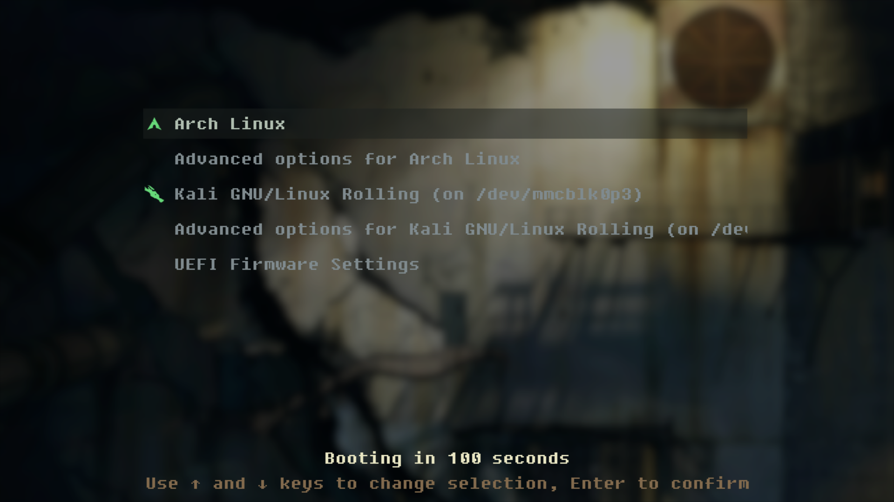

# portal-2-grub-theme

### Uhhh... yes i stealed all from https://github.com/shvchk/fallout-grub-theme, just changed a background and applied Gaussian blur...
##### I may learn more abt making themes in grub

### In order to install this theme, clone (or download and then extract) this repo and run the install.sh script with sudo (don't forget to do `chmod +x install.sh`)

###### Feedback is apreciated btw
